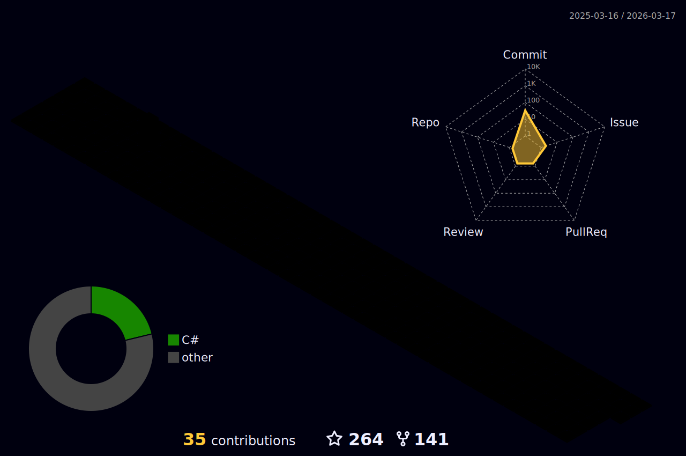

<!-- 访客计数器 -->
<div>
  <h4 align="center">访客数 :eyes:</h4>
  <p align="center"></p>
</div>

### 🤗 欢迎来访

<div>
  <!-- 统计访问者数量 -->
  <a href="https://komarev.com/ghpvc/?username=jianxuanbing">
    
  </a>
  <a href="https://visitor-badge.laobi.icu/badge?page_id=jianxuanbing.jianxuanbing">
    
  </a>
  <!-- Email -->
  <a href="mailto:jianxuanhuo1@126.com">
    
  </a>
  <!-- Stars -->
  <a href="https://img.shields.io/github/stars/jianxuanbing?color=fefb7b&logo=Undertale">
    
  </a>
  <a href="https://github.com/bing-framework/Bing.NetCore">
    
  </a>
  <a href="https://github.com/jianxuanbing?tab=followers">
    
  </a>
  <a href="https://www.jcebing.com">
    
  </a>
  <a href="https://github.com/jianxuanbing/awesome-stars-jianxuanbing#readme">
    
  </a>
  <!-- <a href="">
    
  </a> -->
</div>

### 🔨Tools

<div>
  <a href="https://www.jetbrains.com/zh-cn/idea/">
    
  </a>
  <a href="https://www.jetbrains.com/zh-cn/webstorm/">
    
  </a>
  <a href="https://www.jetbrains.com/zh-cn/pyCharm/">
    
  </a>
  <a href="https://code.visualstudio.com/">
    
  </a>
  <a href="https://www.google.com/chrome/">
    
  </a>
  <a href="https://www.microsoft.com/zh-cn/edge?form=MA13FJ">
    
  </a>
  <a href="https://www.adobe.com/cn/products/photoshop.html">
    
  </a>
</div>

### 🧰 Languages

<div>
  <a href="">
    
  </a>
  <a href="">
    
  </a>
  <a href="https://html.spec.whatwg.org/">
    
  </a>
  <a href="https://www.w3.org/Style/CSS/">
    
  </a>
  <a href="https://www.ecma-international.org/">
    
  </a>
  <a href="https://git-scm.com/">
    
  </a>
  <a href="https://www.php.net/">
    
  </a>
  <a href="https://www.mysql.com/">
    
  </a>
  <a href="https://www.oracle.com/cn/">
    
  </a>
  <a href="https://go.dev/">
    
  </a>
  <a href="https://www.python.org/">
    
  </a>
  <a href="https://www.docker.com/">
    
  </a>
</div>

### 💻 Tech Stack
<details>
<summary>点击展开 ...</summary>

<div>
</div>

</details>

### 📊 Github Stats
<details>
<summary>点击展开 ...</summary>

<div align="center">
  <a href="https://github.com/jianxuanbing">
    
  </a>
  <a href="https://github.com/jianxuanbing">
    
  </a>

  <!-- <a href="https://github.com/jianxuanbing">
    
  </a>
  <a href="https://github.com/jianxuanbing">
    
  </a> -->

  
</div>

<div align="center">
  <a href="https://github.com/jianxuanbing">
    
  </a>
</div>

<div align="center">

  <!-- 贪吃蛇 -->
  
  <!--  -->

  <!-- 打字机 -->
  <a href="https://jcebing.com/">
	  
  </a>

  [](https://raw.githubusercontent.com/jianxuanbing/jianxuanbing/main/profile-3d-contrib/profile-night-rainbow.svg)
</div>


</details>

### 📈 WakaTime Stats

<details>
<summary>点击展开 ...</summary>


<!-- 最近30天每天写代码的时间分布 -->


<!-- 最近30天写代码的语言分布 -->


</details>

### 🕓 Every Day

<details>
<summary>点击展开 ...</summary>

```text
摸鱼   🕓 168h0m ██████████████████████████ 100.0%
干活   🕓 0h0m   ░░░░░░░░░░░░░░░░░░░░░░░░░░ 0.00%
```

<!--START_SECTION:waka-->
**我是早起的 🐤** 

```text
🌞 早晨                     1869 commits        ████░░░░░░░░░░░░░░░░░░░░░   15.51 % 
🌆 白天                     4899 commits        ██████████░░░░░░░░░░░░░░░   40.66 % 
🌃 傍晚                     3836 commits        ████████░░░░░░░░░░░░░░░░░   31.83 % 
🌙 晚上                     1446 commits        ███░░░░░░░░░░░░░░░░░░░░░░   12.00 % 
```
📅 **我最有效率是在 星期三** 

```text
星期一                      1818 commits        ████░░░░░░░░░░░░░░░░░░░░░   15.09 % 
星期二                      2037 commits        ████░░░░░░░░░░░░░░░░░░░░░   16.90 % 
星期三                      2245 commits        █████░░░░░░░░░░░░░░░░░░░░   18.63 % 
星期四                      2032 commits        ████░░░░░░░░░░░░░░░░░░░░░   16.86 % 
星期五                      1740 commits        ████░░░░░░░░░░░░░░░░░░░░░   14.44 % 
星期六                      1088 commits        ██░░░░░░░░░░░░░░░░░░░░░░░   09.03 % 
星期日                      1090 commits        ██░░░░░░░░░░░░░░░░░░░░░░░   09.05 % 
```


📊 **本周消耗时间** 

```text
💬 编程语言: 
C#                       12 hrs 16 mins      ███████████████░░░░░░░░░░   59.45 % 
Python                   7 hrs 26 mins       █████████░░░░░░░░░░░░░░░░   36.09 % 
Java                     26 mins             █░░░░░░░░░░░░░░░░░░░░░░░░   02.18 % 
Other                    19 mins             ░░░░░░░░░░░░░░░░░░░░░░░░░   01.56 % 
Bash                     4 mins              ░░░░░░░░░░░░░░░░░░░░░░░░░   00.33 % 

🔥 编辑器: 
Visual Studio            10 hrs 56 mins      █████████████░░░░░░░░░░░░   53.04 % 
VS Code                  9 hrs 41 mins       ████████████░░░░░░░░░░░░░   46.96 % 
```


<!--END_SECTION:waka-->

</details>

### :basecampy: GitHub最近动态

<details open>
<summary>点击展开 ...</summary>

<table align="center">
<tr>
<td valign="top">

<!--START_SECTION:activity-->
1. 🗣 Commented on [#41](https://github.com/bing-framework/Bing.NetCore/issues/41#issuecomment-1897722936) in [bing-framework/Bing.NetCore](https://github.com/bing-framework/Bing.NetCore)
<!--END_SECTION:activity-->

</td>
</tr>
</table>
</details>

### 📑 Sites

<div>
  <a href="https://www.bilibili.com/">
    
  </a>
  <a href="https://github.com/">
    
  </a>
  <a href="https://www.zhihu.com/">
    
  </a>
</div>

