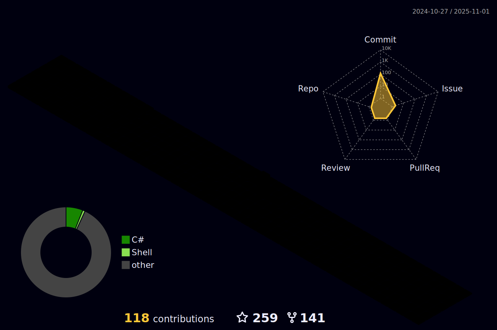

<!-- 访客计数器 -->
<div>
  <h4 align="center">访客数 :eyes:</h4>
  <p align="center"></p>
</div>

### 🤗 欢迎来访

<div>
  <!-- 统计访问者数量 -->
  <a href="https://komarev.com/ghpvc/?username=jianxuanbing">
    
  </a>
  <a href="https://visitor-badge.laobi.icu/badge?page_id=jianxuanbing.jianxuanbing">
    
  </a>
  <!-- Email -->
  <a href="mailto:jianxuanhuo1@126.com">
    
  </a>
  <!-- Stars -->
  <a href="https://img.shields.io/github/stars/jianxuanbing?color=fefb7b&logo=Undertale">
    
  </a>
  <a href="https://github.com/bing-framework/Bing.NetCore">
    
  </a>
  <a href="https://github.com/jianxuanbing?tab=followers">
    
  </a>
  <a href="https://www.jcebing.com">
    
  </a>
  <a href="https://github.com/jianxuanbing/awesome-stars-jianxuanbing#readme">
    
  </a>
  <!-- <a href="">
    
  </a> -->
</div>

### 🔨Tools

<div>
  <a href="https://www.jetbrains.com/zh-cn/idea/">
    
  </a>
  <a href="https://www.jetbrains.com/zh-cn/webstorm/">
    
  </a>
  <a href="https://www.jetbrains.com/zh-cn/pyCharm/">
    
  </a>
  <a href="https://code.visualstudio.com/">
    
  </a>
  <a href="https://www.google.com/chrome/">
    
  </a>
  <a href="https://www.microsoft.com/zh-cn/edge?form=MA13FJ">
    
  </a>
  <a href="https://www.adobe.com/cn/products/photoshop.html">
    
  </a>
</div>

### 🧰 Languages

<div>
  <a href="">
    
  </a>
  <a href="">
    
  </a>
  <a href="https://html.spec.whatwg.org/">
    
  </a>
  <a href="https://www.w3.org/Style/CSS/">
    
  </a>
  <a href="https://www.ecma-international.org/">
    
  </a>
  <a href="https://git-scm.com/">
    
  </a>
  <a href="https://www.php.net/">
    
  </a>
  <a href="https://www.mysql.com/">
    
  </a>
  <a href="https://www.oracle.com/cn/">
    
  </a>
  <a href="https://go.dev/">
    
  </a>
  <a href="https://www.python.org/">
    
  </a>
  <a href="https://www.docker.com/">
    
  </a>
</div>

### 💻 Tech Stack
<details>
<summary>点击展开 ...</summary>

<div>
</div>

</details>

### 📊 Github Stats
<details>
<summary>点击展开 ...</summary>

<div align="center">
  <a href="https://github.com/jianxuanbing">
    
  </a>
  <a href="https://github.com/jianxuanbing">
    
  </a>

  <!-- <a href="https://github.com/jianxuanbing">
    
  </a>
  <a href="https://github.com/jianxuanbing">
    
  </a> -->

  
</div>

<div align="center">
  <a href="https://github.com/jianxuanbing">
    
  </a>
</div>

<div align="center">

  <!-- 贪吃蛇 -->
  
  <!--  -->

  <!-- 打字机 -->
  <a href="https://jcebing.com/">
	  
  </a>

  [](https://raw.githubusercontent.com/jianxuanbing/jianxuanbing/main/profile-3d-contrib/profile-night-rainbow.svg)
</div>


</details>

### 📈 WakaTime Stats

<details>
<summary>点击展开 ...</summary>


<!-- 最近30天每天写代码的时间分布 -->


<!-- 最近30天写代码的语言分布 -->


</details>

### Day

```text
摸鱼   🕓 168h0m ██████████████████████████ 100.0%
干活   🕓 0h0m   ░░░░░░░░░░░░░░░░░░░░░░░░░░ 0.00%
```

<!--START_SECTION:waka-->
**I'm an Early 🐤** 

```text
🌞 Morning                1869 commits        ████░░░░░░░░░░░░░░░░░░░░░   15.54 % 
🌆 Daytime                4895 commits        ██████████░░░░░░░░░░░░░░░   40.70 % 
🌃 Evening                3836 commits        ████████░░░░░░░░░░░░░░░░░   31.90 % 
🌙 Night                  1426 commits        ███░░░░░░░░░░░░░░░░░░░░░░   11.86 % 
```
📅 **I'm Most Productive on Wednesday** 

```text
Monday                   1815 commits        ████░░░░░░░░░░░░░░░░░░░░░   15.09 % 
Tuesday                  2034 commits        ████░░░░░░░░░░░░░░░░░░░░░   16.91 % 
Wednesday                2242 commits        █████░░░░░░░░░░░░░░░░░░░░   18.64 % 
Thursday                 2026 commits        ████░░░░░░░░░░░░░░░░░░░░░   16.85 % 
Friday                   1737 commits        ████░░░░░░░░░░░░░░░░░░░░░   14.44 % 
Saturday                 1085 commits        ██░░░░░░░░░░░░░░░░░░░░░░░   09.02 % 
Sunday                   1087 commits        ██░░░░░░░░░░░░░░░░░░░░░░░   09.04 % 
```


📊 **This Week I Spent My Time On** 

```text
🕑︎ Time Zone: Asia/Shanghai

💬 Programming Languages: 
C#                       9 hrs 16 mins       ██████████████░░░░░░░░░░░   56.60 % 
Markdown                 2 hrs 33 mins       ████░░░░░░░░░░░░░░░░░░░░░   15.62 % 
EJS                      1 hr 10 mins        ██░░░░░░░░░░░░░░░░░░░░░░░   07.20 % 
Other                    51 mins             █░░░░░░░░░░░░░░░░░░░░░░░░   05.19 % 
Binary                   46 mins             █░░░░░░░░░░░░░░░░░░░░░░░░   04.69 % 

🔥 Editors: 
Visual Studio            10 hrs 26 mins      ████████████████░░░░░░░░░   63.72 % 
VS Code                  5 hrs 56 mins       █████████░░░░░░░░░░░░░░░░   36.28 % 

💻 Operating System: 
Windows                  16 hrs 22 mins      █████████████████████████   100.00 % 
```


 Last Updated on 18/01/2024 06:33:48 UTC
<!--END_SECTION:waka-->

### :basecampy: GitHub最近动态

<details open>
<summary>点击展开 ...</summary>

<table align="center">
<tr>
<td valign="top">

<!--START_SECTION:activity-->
1. 🗣 Commented on [#41](https://github.com/bing-framework/Bing.NetCore/issues/41#issuecomment-1897722936) in [bing-framework/Bing.NetCore](https://github.com/bing-framework/Bing.NetCore)
<!--END_SECTION:activity-->

</td>
</tr>
</table>
</details>

### 📑 Sites

<div>
  <a href="https://www.bilibili.com/">
    
  </a>
  <a href="https://github.com/">
    
  </a>
  <a href="https://www.zhihu.com/">
    
  </a>
</div>

